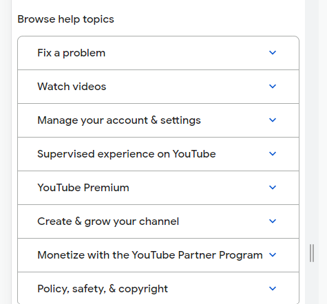
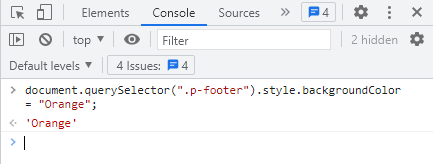
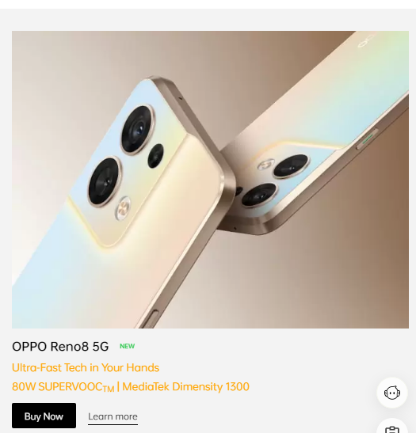

# Dom Manipulation Assignment

1. Webiste Name: [Dev To](https://dev.to/)

### Topics

    - Query Selctory, Inner HTML

### Reference Image

### Tasks

        Target the Top description div and change the DEV Community to <Your_Name> and description to your passion

 

### Code

### Output

 

 

2. Website Name: [Apple](https://support.apple.com/en-in)

### Task

### Fetch all the product name and store in an array

 

### Code & Output

 

 

3. Webiste Name: [Youtube Support](https://support.google.com/youtube/)

### Topics

    - Get Element By Id, Create Element, Create Text Node, Append Child

### Reference Image

### Tasks

     Add another FAQ 'My New FAQ' to the list

 

### Code

### Output

 

 

4. Webiste Name: [OnePlus](https://www.oneplus.in/support)

### Topics

     Query Selector, InnerText

### Reference Image

### Tasks

      Change the contact number

 

### Code

### Output

 

 

5. Webiste Name: [Samsung](https://www.samsung.com/in/offer/online/samsung-fest/)

### Topics

       getElementById, InnerText

### Reference Image

### Tasks

     Target the main div of card and change the Button text to Check out

 

### Code

### Output

 

 

6. Webiste Name: [Adidas](https://www.adidas.co.in/)

### Topics

    -   Query Selector, Event listeners, Changing Styles

### Reference Image

### Tasks

     Target the search box and on hover change the background color to red.

 

### Code

### Output

 

 

7. Webiste Name: [MDN Web Docs](https://developer.mozilla.org/en-US/)

### Topics

       Form, Value, Submit

### Reference Image

### Tasks

     To Search a topic in the MDN Search bar.
     First add a text to search in the search bar and then hit the submit search button to search the docs using DOM

 

### Code

### Output

 

 

8. Webiste Name: [Google](https://www.google.com/)

### Topics

       Remove Elements

### Reference Image

### Tasks

     Remove alternate languages from the home page languages listed

 

### Code

### Output

 

 

9. Webiste Name: [Code Wars](https://www.codewars.com/)

### Topics

       Change Font Family, Color of Text.

### Reference Image

### Tasks

    Change the font family of the text to monospace and text color to the logo’s background color.

 

### Code

### Output

 

 

10. Webiste Name: [Freecodecamp](https://www.freecodecamp.org/)

### Topics

       querySelector, mouseover, click eventListener,  callback function, style,

### Reference Image

### Tasks

    Target the button and change background colour on mouseover

 

### Code

### Output

 

 

11. Webiste Name: [realme](https://www.realme.com/in/)

### Topics

       querySelector,style,background-image

### Reference Image

### Tasks

    change the realme logo to ineuron logo

 

### Code

### Output

 

 

12. Webiste Name: [Github](https://github.com/)

### Topics

       querySelector,style,background-Color

### Reference Image

### Tasks

     change the background colour of the button to blue.

 

### Code

### Output

 

 

13. Webiste Name: [Hackerrank](https://www.hackerrank.com/)

### Topics

       querySelector,innerHtml

### Reference Image

### Tasks

    Target the top description and change “Matching developers with great companies” to ‘JSBOOTCAMP“.

 

### Code

### Output

 

 

14. Webiste Name: [Asus](https://www.asus.com/in/)

### Topics

      querySelector,style,font-size

### Reference Image

### Tasks

       change the fontsize of “Hot Deals” to 80px

 

### Code

### Output

 

 

15. Webiste Name: [Dell](https://www.dell.com/en-in/shop/deals/laptop-deals?gacd=10415953-9016-5761040-285981356-0&dgc=ST&gclid=Cj0KCQjwguGYBhDRARIsAHgRm4-XUDMhhVNyHXb3s1gY4ZBzORr_d9Se-buhJwy7asyUe7YdqEA11eEaAt6UEALw_wcB&gclsrc=aw.ds&nclid=BxjBlpBQsX6pjSHh-L8YYSU77EpfXRkG1AGMB5Wbeu386ykspfrPDnfx_DdFau20)

### Topics

      querySelector,style.textAlign

### Reference Image

### Tasks

       Convert the text “G15 Gaming Laptop” from left to right

 

### Code

### Output

 

 

16. Webiste Name: [Vercel](https://vercel.com/)

### Topics

     querySelector,innerHTMl

### Reference Image

### Tasks

      change the heading “Start with the developer” to “Start with Scratch”

 

### Code

### Output

 

 

17. Webiste Name: [Sony](https://www.sony.co.in/)

### Topics

    querySelector,innerHTMl

### Reference Image

### Tasks

     change the button text To current Date.

 

### Code

### Output

 

 

18. Webiste Name: [Philips](https://www.philips.co.in/)

### Topics

     querySelector,style,backgroundcolor

### Reference Image

### Tasks

    change the background colour blue to orange

 

### Code

### Output

 

 

19. Webiste Name: [Canon](https://in.canon/)

### Topics

          querySelector,src

### Reference Image

### Tasks

    extract the canon logo

 

### Code & Output

 

 

20. Webiste Name: [Oppo](https://www.oppo.com/in/)

### Topics

          querySelector,style,color

### Reference Image

### Tasks

      Change the description colour black to orange

 

### Code

### Output

 

 

[LinkedIn](https://www.linkedin.com/in/shubham-singh-b122b7171/)

[Personal Portfolio](https://shubhambhoj.in/)

[Read Blogs](https://shubhambhoj.hashnode.dev/)

#### SHUBHAM SINGH